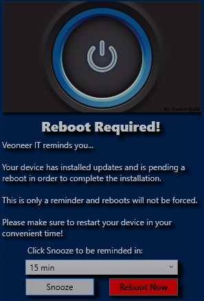

# Reboot-Dialog
Will run silently in background and show a popup dialog when reboot is needed with snooze options.

I made this program to solve an issue i was facing where we did not want to force reboots of clients but simply inform them that a reboot was needed with a reminder dialog and snooze options.

This program is made only for Windows and .Net 4.6+ is required.
The program will detect on two things at this time:
1. Windows Update is installed and pending reboot
2. Microsoft System Center Configuration Manager (SCCM) have installed update or application that require reboot
(More to come)

It does not use/require network access and is fully customizable in the dialog.
You can change picture, text fields and button text to make it look the way you want it or branded to your company.
All the text can be changed from the file "Reboot Dialog.exe.config".
To change picture you need to place a file in the same directory called "Picture.png" with size 555x312.

Snooze options are set to 15min, 30min, 1 hour or 2 hours.
Program will check silently in the background every 5min if there is a pending reboot.

I hope you find it usefull :-)

